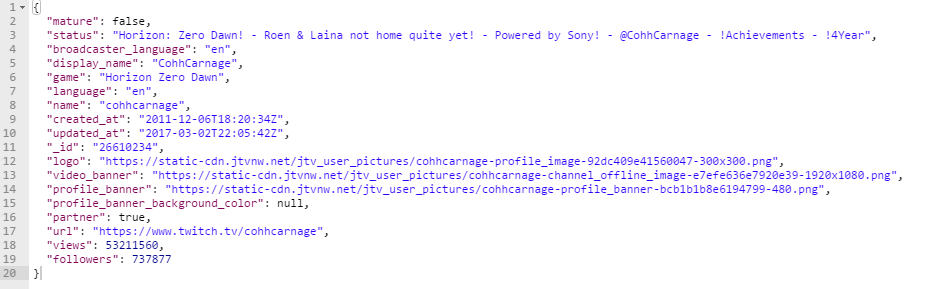
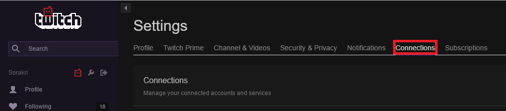
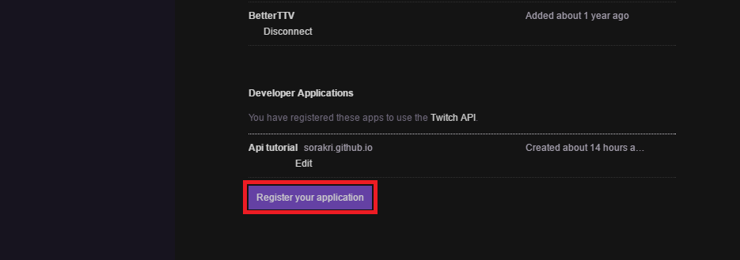
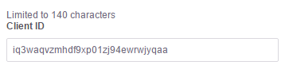

## Introduction

We are going to be working with Twitch's api version 5, and using it to search for channels.  API stands for Application Programming Interface, and API's are used to allow programs to interface with the service an API is made for.  In twitch's case, we can use their API to search their database for users, channels, or other information.

### What that info looks like


## Getting started

The first thing we need to do is to get ourselves an API key.  You do this by signing in or registering an account with twitch, then going to the connections tab in account settings. 

At the bottom of the connections tab, you will find a button to register your application


This will bring up a page for you to register your application at.  It provides twitch with some information on the intent of your application, and is simple to fill out.  Once you have registered, their should be a field with an client-id in it. 

This id is what will identify your requests to twitch's services, letting it know your are authorized to ask and recieve information.  


## Now for some code

Now that we have an api-key, we can start with the code that actually calls the api.  There are multiple ways to do this, but we will use AJAX to make a XMLHttpRequest and send it to twitch.  To do this in javascript, we start with creating the base request.
```markdown
var req = new XMLHttpRequest();
```
Next we open the request and put in the request method, which tells twitch which request method to use, and a url, which is where we are sending the request.  The last part is true or false, and tells if we are sending a synchronous or asynchoronous request, which determines if we wait for a response before continuing running our code or not.

```markdown
var req = new XMLHttpRequest();
req.open("get", "https://api.twitch.tv/kraken/search/channels?query=cohhcarnage", true);
```


```markdown
var req = new XMLHttpRequest();
```


```markdown
var req = new XMLHttpRequest();
```


```markdown
var req = new XMLHttpRequest();
```


```markdown
Syntax highlighted code block

# Header 1
## Header 2
### Header 3

- Bulleted
- List

1. Numbered
2. List

**Bold** and _Italic_ and `Code` text

[Link](url) and 
```

For more details see [GitHub Flavored Markdown](https://guides.github.com/features/mastering-markdown/).

### Jekyll Themes

Your Pages site will use the layout and styles from the Jekyll theme you have selected in your [repository settings](https://github.com/Sorakri/Sorakri.github.io/settings). The name of this theme is saved in the Jekyll `_config.yml` configuration file.

### Support or Contact

Having trouble with Pages? Check out our [documentation](https://help.github.com/categories/github-pages-basics/) or [contact support](https://github.com/contact) and we’ll help you sort it out.
